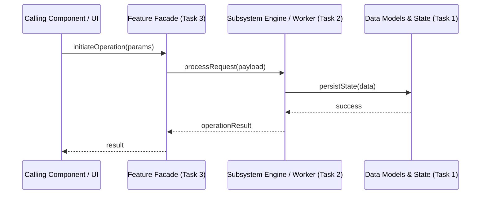

# Feature Technical Specification: [Feature Name]

> **Instructions**: This document consolidates the 3 core technical design pillars agreed upon during task planning. It serves as the single source of truth comment on the Parent Feature issue. Detailed method signatures, parameter types, and usage code are refined Just-In-Time in Phase 0 of each task.

## Document Governance

| Field | Details |
|---|---|
| **Feature Issue** | #[Feature Issue Number] |
| **Status** | [Draft \| In Review \| Approved] |
| **Lead Engineer** | [Name / Role] |
| **Last Updated** | [YYYY-MM-DD] |

---

# 📄 Document 1: High-Level Domain Model & Class Naming Conventions

> **Goal**: Define the domain architecture, class roles, naming standards, and high-level facade concepts.

## 1.1 Domain Concepts & Architectural Entities
- **`[Entity/Class 1 Name]`**: [Core responsibility, state maintained, architectural layer (e.g. Engine / Storage / Facade)]
- **`[Entity/Class 2 Name]`**: [Core responsibility, state maintained, architectural layer]
- **`[Entity/Class 3 Name]`**: [Core responsibility, state maintained, architectural layer]

## 1.2 Naming Conventions & Design Standards
- **Naming Conventions**: [e.g. PascalCase for classes/types, camelCase for methods, UPPER_CASE for constants, specific project prefixes]
- **Error Handling Pattern**: [e.g. Return `AppResult` / Error Codes / Exceptions / Result<T, E>]
- **Memory & Concurrency Model**: [e.g. Thread-safe with internal mutexes / single-threaded event loop / immutable structs]

## 1.3 High-Level Public Facade Concept
- **Primary Consumer Entrypoint**: [Name of the main public facade class or function group]
- **High-Level Interaction Pattern**: [How external callers or UI components interact with this feature at a conceptual level]

---

# 📄 Document 2: Feature Architecture & Task Decomposition

> **Goal**: Detail the internal architecture, decompose the feature into sequenced tasks, and show how they interact.

## 2.1 Subsystem Architecture & Interaction Flow

## 2.2 Architectural Decisions (ADRs)
- **ADR-01: [Decision Title]**
  - **Context**: [Why this decision was needed]
  - **Decision**: [Chosen technical approach]
  - **Trade-offs**: [Pros and cons accepted]

## 2.3 Granular Task Decomposition
1. **Task 1: [Short Title] (Scaffolding / Data Models / Storage)**
   - **Scope**: [Data models, internal state structures, or foundational scaffolding]
   - **Deliverable**: [Concrete files, structures, and unit tests]
2. **Task 2: [Short Title] (Core Subsystem / Engine / Worker)**
   - **Scope**: [Implement core internal logic, data pipelines, thread workers, or business rules]
   - **Deliverable**: [Internal engine implementation and subsystem unit/integration tests]
3. **Task 3: [Short Title] (Public Facade / Integration & Edge Cases)**
   - **Scope**: [Connect public API facade to internal engine, handle edge cases, error recovery, and end-to-end flow]
   - **Deliverable**: [Complete integration, public interface docstrings, and verification against Document 3 test plan]

## 2.4 Task Interaction & Dependency Matrix
| Task | Depends On | Interacts With | Role in Overall Feature |
|---|---|---|---|
| **Task 1** | None | Storage / Subsystem A | Provides foundational data structures |
| **Task 2** | Task 1 | Task 1 Data Layer | Implements core engine / processing logic |
| **Task 3** | Task 2 | Caller & Task 2 Engine | Exposes public API facade and integration |

---

# 📄 Document 3: Agreed Test Plan & Verification Strategy

> **Goal**: Define the test cases and verification methodology to prove correctness.

## 3.1 Key Test Scenarios
- **Critical Paths (Happy Path)**:
  - [Test Case 1: Standard valid payload execution]
  - [Test Case 2: Multi-step lifecycle flow]
- **Edge Cases & Failure Modes**:
  - [Test Case 3: Empty / malformed payload handling]
  - [Test Case 4: Network timeout / storage failure recovery]

## 3.2 Testing Approach & Mocking Strategy
- **Unit Testing**: [Scope of unit tests, isolated classes]
- **Mocking Strategy**: [External services or downstream components to mock/fake]
- **Integration Testing**: [End-to-end component flow verification]

## 3.3 Acceptance Benchmarks (FRD Validation)
- [ ] [Benchmark 1: Response latency within threshold]
- [ ] [Benchmark 2: 100% test suite pass rate in CI]
