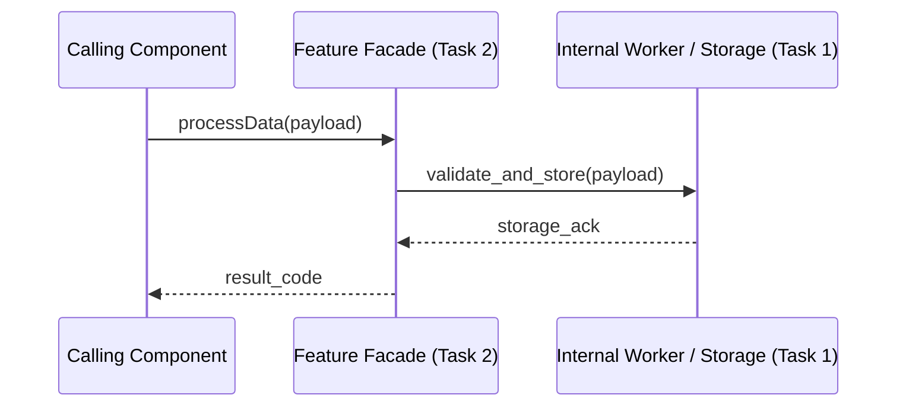

# Feature Technical Specification: [Feature Name]

> **Instructions**: This document consolidates the 3 core technical design pillars agreed upon during task planning. It serves as the single source of truth comment on the Parent Feature issue.

## Document Governance

| Field | Details |
|---|---|
| **Feature Issue** | #[Feature Issue Number] |
| **Status** | [Draft \| In Review \| Approved] |
| **Lead Engineer** | [Name / Role] |
| **Last Updated** | [YYYY-MM-DD] |

---

# 📄 Document 1: Public Interface & Usage Specification

> **Goal**: Define the public contract and show how consumers will interact with this feature.

## 1.1 Public API & Class Signatures
[Define the exact public interfaces, classes, function signatures, and parameter annotations]

```cpp
/**
 * @file [feature_header.h]
 * @brief Public interface contract for [Feature Name].
 */
#pragma once

#include <string>
#include <vector>

class FeatureFacade {
public:
    /**
     * @brief Executes the primary feature capability.
     * @param[in] input_data Input payload for processing.
     * @return Execution result code or payload.
     * @throws std::runtime_error On critical failure.
     */
    int processData(const std::string& input_data);
};
```

## 1.2 Data Structures & Schemas
- **Input Models**: [Definitions of input structs, DTOs, or JSON schemas]
- **Output Models**: [Definitions of return structs or response types]

## 1.3 Usage Guide & Complete Code Example
```cpp
#include "[feature_header.h]"
#include <iostream>

int main() {
    FeatureFacade feature;
    try {
        int result = feature.processData("sample payload");
        std::cout << "Success with code: " << result << std::endl;
    } catch (const std::exception& e) {
        std::cerr << "Error: " << e.what() << std::endl;
        return 1;
    }
    return 0;
}
```

## 1.4 Error Handling & Contracts
- **Error Strategy**: [Exceptions / Result types / Error codes]
- **Guarantees**: [Thread-safety, immutability, idempotent behaviors]

---

# 📄 Document 2: Feature Architecture & Task Decomposition

> **Goal**: Detail the internal architecture, decompose the feature into sequenced tasks, and show how they interact.

## 2.1 Subsystem Architecture & Interaction Flow


## 2.2 Architectural Decisions (ADRs)
- **ADR-01: [Decision Title]**
  - **Context**: [Why this decision was needed]
  - **Decision**: [Chosen technical approach]
  - **Trade-offs**: [Pros and cons accepted]

## 2.3 Granular Task Decomposition
1. **Task 1: [Short Title]**
   - **Scope**: [Data models, schema, or low-level primitives]
   - **Deliverable**: [Concrete files and unit tests]
2. **Task 2: [Short Title]**
   - **Scope**: [Core internal business logic / engine / storage]
   - **Deliverable**: [Engine implementation and integration tests]
3. **Task 3: [Short Title]**
   - **Scope**: [Public API Facade / Controller / Consumer Interface]
   - **Deliverable**: [Public contract implementation and end-to-end verification]

## 2.4 Task Interaction & Dependency Matrix
| Task | Depends On | Interacts With | Role in Overall Feature |
|---|---|---|---|
| **Task 1** | None | Storage / Subsystem A | Provides foundational data models |
| **Task 2** | Task 1 | Task 1 Data Layer | Implements core business logic |
| **Task 3** | Task 2 | Caller & Task 2 Engine | Exposes public API contract |

---

# 📄 Document 3: Agreed Test Plan & Verification Strategy

> **Goal**: Define the test cases and verification methodology to prove correctness.

## 3.1 Key Test Scenarios
- **Critical Paths (Happy Path)**:
  - [Test Case 1: Standard valid payload execution]
  - [Test Case 2: Multi-step lifecycle flow]
- **Edge Cases & Failure Modes**:
  - [Test Case 3: Empty / malformed payload handling]
  - [Test Case 4: Network timeout / storage failure recovery]

## 3.2 Testing Approach & Mocking Strategy
- **Unit Testing**: [Scope of unit tests, isolated classes]
- **Mocking Strategy**: [External services or downstream components to mock/fake]
- **Integration Testing**: [End-to-end component flow verification]

## 3.3 Acceptance Benchmarks (FRD Validation)
- [ ] [Benchmark 1: Response latency within threshold]
- [ ] [Benchmark 2: 100% test suite pass rate in CI]
