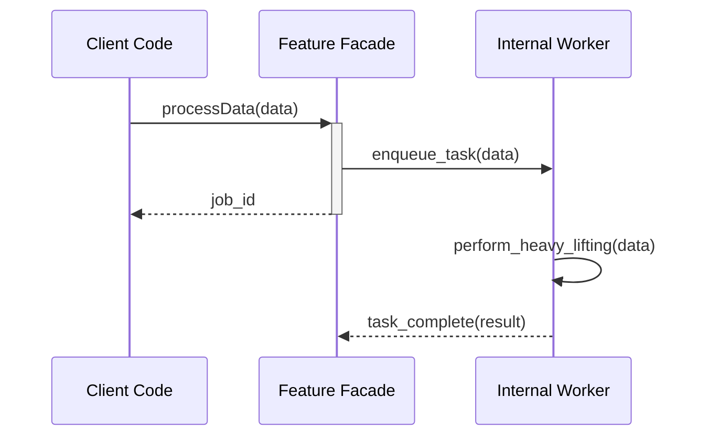

# Feature Specification: [Feature Name]

> **Instructions**: This is a template. Please replace the bracketed [text] and delete all italicized instructional text as you fill out the document. The goal is to create a concise but comprehensive guide for developers who will use or maintain this feature.

## Document Governance

| Field | Details |
|-------|---------|
| **Status** | [Draft \| In Review \| Approved \| Deprecated] |
| **Author(s)** | [Your Name, Your Role] |
| **Reviewer(s)** | [Name(s) of Reviewers] |
| **Last Updated** | [YYYY-MM-DD] |

---

## 1. Feature Overview & Scope

> **Goal**: In this section, provide a high-level summary. Anyone, including a new team member or a product manager, should be able to read this section and understand what the feature does and what its boundaries are.
>
> **Instructions**: Answer the questions below in clear, simple language. Be explicit about what the feature does not do.

### What is the core purpose of this feature?
[Describe the problem this feature solves or the capability it adds. For example: "This feature provides a thread-safe, in-memory caching service to reduce database load for frequently accessed user profile data."]

### Who is the intended audience or consumer of this feature?
[e.g., "Backend service developers," "All C++ services within the Constellation project."]

### What is IN SCOPE?
- [List the key functionalities and components that are part of this feature. Be specific.]
- [e.g., In-memory storage of key-value pairs.]
- [e.g., Time-to-live (TTL) expiration of cached items.]
- [e.g., A C++ header file defining the public API.]

### What is explicitly OUT OF SCOPE?
- [List functionalities that this feature intentionally does not handle. This is crucial for managing expectations.]
- [e.g., Data persistence to disk; the cache is volatile.]
- [e.g., Network transport for a distributed cache.]
- [e.g., The format of the data being cached.]

---

## 2. Architectural Rationale (The "Why")

> **Goal**: Explain the key design decisions. This is the most important section for future maintainers. It prevents them from accidentally breaking a non-obvious design choice.
>
> **Instructions**: For each major architectural decision (e.g., choice of concurrency model, data structure, third-party library), fill out a brief "Architecture Decision Record" (ADR) below. You can copy the template for multiple decisions.

### Architecture Decision Record (ADR-01)

**Decision Title**: [e.g., "Use a Thread Pool for Asynchronous Operations"]

**Context & Problem**:
[Briefly describe the problem you were trying to solve. e.g., "The feature needs to handle multiple concurrent requests without blocking the main application thread. We needed a robust way to manage concurrent tasks."]

**The Decision**:
[State the decision clearly. e.g., "We decided to implement a fixed-size thread pool to process all incoming requests asynchronously."]

**Alternatives Considered**:
[List other options you thought about and why you rejected them. e.g., "1. Thread-per-request: Rejected due to the high overhead of creating/destroying threads, which would not scale. 2. External Message Queue: Rejected as it added an external dependency and complexity not required for this service."]

**The Trade-Offs (Pros & Cons)**:
- **Pros**: [e.g., "Controls resource consumption by limiting concurrent threads. Reuses threads to reduce creation overhead."]
- **Cons**: [e.g., "If all threads are busy, new tasks will be queued, increasing latency. Potential for deadlocks if tasks depend on each other."]

---

## 3. How It Works (Diagram & API)

> **Goal**: Show, don't just tell. Provide a visual overview of the feature's structure and define its public contract.
>
> **Instructions**: Create a simple diagram (Sequence, Class, or Flowchart) to illustrate the feature's logic. Then, provide the Doxygen-commented public header file content. This header is the definitive contract for your feature.

### Visual Logic

[Insert a diagram here. If using a "Diagrams as Code" tool like PlantUML or Mermaid, you can paste the code here or link to the generated image. A simple sequence diagram showing a common use case is often the most effective.]

**Example Sequence Diagram**:



### The Public API Contract (Header File)

> The commented header file below is the single source of truth for the API. It defines how a developer can interact with this feature.

```cpp
/**
 * @file [your_feature.h]
 * @brief [A one-line description of what this header declares.]
 * @author [Your Name]
 */
#pragma once

#include <string>
#include <vector>

// Add any necessary forward declarations here
class SomeDependency;

/**
 * @brief [Briefly describe the purpose of this class/struct.]
 * @details [Provide more details about its responsibilities, invariants,
 * and thread-safety guarantees (e.g., "This class is thread-safe.")]
 */
class FeatureFacade {
public:
    /**
     * @brief [A one-line summary of the function's purpose.]
     *
     * @param[in] input_data Describe the parameter and its purpose.
     * @return A description of the return value.
     * @throws std::runtime_error if a critical error occurs.
     * @note Any special considerations for this function.
     */
    int processData(const std::string& input_data);

    // ... other public methods ...

private:
    // ... private members and helper functions ...
};
```

---

## 4. How to Use It (Implementation Examples)

> **Goal**: Provide practical, copy-paste-friendly examples. This is the first place a new user will look.
>
> **Instructions**: Write a step-by-step procedure for the most common use case. Then, provide at least one complete, compilable code example. Ensure this example is tested and works.

### Step-by-Step Usage

1. **Include the header**:
   ```cpp
   #include "[path/to/your_feature.h]"
   ```

2. **Instantiate the feature's main class**:
   ```cpp
   FeatureFacade my_feature;
   ```

3. **Call the primary method**:
   ```cpp
   int result = my_feature.processData("some data");
   ```

4. **Handle the result**:
   [Describe how to interpret the return value or check for errors.]

### Complete Code Example: Basic Usage

> This code should be compilable and tested. It's best practice to have this live in an `examples/` directory in your source repository and link to it.

```cpp
#include "[path/to/your_feature.h]"
#include <iostream>
#include <stdexcept>

int main() {
    FeatureFacade my_feature;
    std::string data_to_process = "example input";

    std::cout << "Attempting to process data..." << std::endl;

    try {
        int result_code = my_feature.processData(data_to_process);
        std::cout << "Successfully processed data. Result code: " << result_code << std::endl;

    } catch (const std::runtime_error& e) {
        std::cerr << "An error occurred: " << e.what() << std::endl;
        return 1; // Indicate failure
    }

    return 0; // Indicate success
}
```

---

## 5. Important Contracts & Guarantees

> **Goal**: Set clear expectations for non-functional behavior. How does the feature fail? How fast is it?
>
> **Instructions**: Be specific and provide data if possible. These are promises you are making to the feature's users.

### Error Handling
[Describe the primary error handling strategy (e.g., exceptions, error codes). Refer to the header file for specifics on what functions can fail. e.g., "This feature uses exceptions to report all runtime errors. See the @throws tags in the header file for details on which functions can throw."]

### Performance
[Provide key performance characteristics. Use Big-O notation for algorithmic complexity and real numbers from benchmarks if available.]

- **Algorithmic Complexity**: [e.g., "The processData() method has a time complexity of O(n), where n is the size of the input data."]
- **Measured Performance**: [e.g., "In benchmarks on standard production hardware, the 99th percentile latency for processData() with a 1KB payload is 15ms."]
